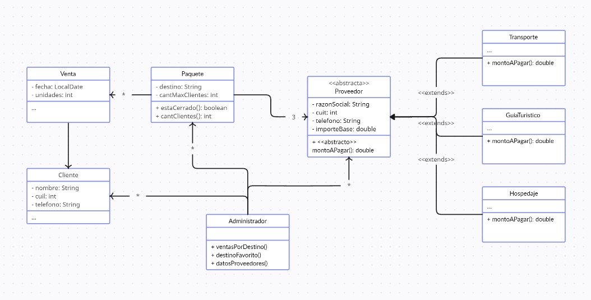

* El problema es que una persona no puede ser simultaneamente un pasajero y un tripulante
* Esto ocurre no por una limitacion de herencia, si no por usar esta estrategia donde tal vez corresponderia otra
* Como alternativa cada persona tendra una lista de roles que se le van asignando (pasajero / tripulante)

